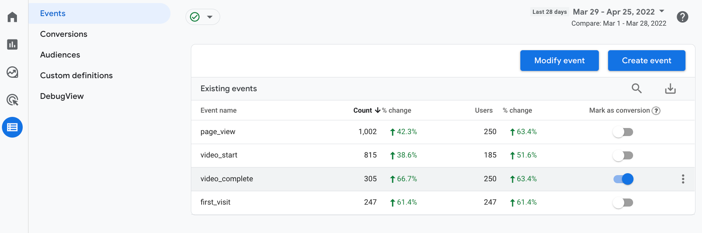

Don't Panic
===========

When people write click-bait ads, they often add numbers to the headline to make you more interested. It makes sense- we crave certainty, and numbers provide that. So, I promised 3 advantages to GA4, but the truth is there's quite a few more. We're just getting warmed up, but three is as good a place as any to start.

#1 User-Centric Reporting
-------------------------

Universal Analytics really tended to focus on the visit, or in UA parlance, the session. There was talk of pages per session, and of whether or not a session converted. Sessions aren't gone from GA4- there's still the "Engaged Session" metric after all, *but* that metric is centered on the engagement, which, in a subtle way, is the user.

While it's a different model, it makes a lot of sense. Do you really care how many "sessions" from Google "convert"? Or do you care about how many __people__ buy your product or sign up for your marketing list? Metrics wise, it's kind of the same thing, but  the change in the mental framework I think opens us up to think a bit more about exactly what we're looking to track and how to get there.

#2 Focus on what the user __does__
----------------------------------

Out of the box, Universal Analytics was great at telling you what people did on your website. As long as all they did was view webpages. But what if someone made it to your products' page and then downloaded a PDF with more information? Or watched an embedded youtube video on the page? 

With a basic installation of Universal Analytics, that user would look like this in the reports:

|Page          		|Pageviews	|Time Action Happened
|-------------------|-----------|--------------------
|/home.htm		|	    1   |        3:04:00 pm
|/product-details.htm	|	    1   |        3:04:05 pm

Because GA only saw the two pageviews come from the user, the users' session is said to have a 5 second time on site.

Now, that SAME user, doing the same things on the site would look like the following to GA4.

|Event_Name		|Actions        |page_location									|Time Action Happened	
|---------------|---------------|-----------------------------------------------|--------------------
|page_view	 	|	1	        |http://www.example.com/home.htm				|3:04:00 pm
|page_view      |       1       |http://www.example.com/product-details.htm     |3:04:05 pm
|video_start    |       1       |http://www.example.com/product-details.htm     |3:04:25 pm
|video_start		|	1	|http://www.example.com/product-details.htm	 |3:05:10 pm
|video_complete		|	1	|http://www.example.com/product-details.htm	 |3:05:40 pm
|file_download		|	1	|http://www.example.com/product-details.htm	 |3:06:12 pm

Let's unpack what happened between the two measurements platforms.

Like we said before, the user experience was exactly the same for the user. However, in the default version of GA4 now gives us a much richer picture of what this user did and what their interests are.

	1) Time on site went from **5 seconds** (UA GA) to **2 minutes 12 seconds** (GA4)
	2) We discovered they **downloaded a PDF**
	3) The user *started the video twice*- is there something compelling in the opening? Or was the user distracted?No way to tell yet, but we have more insight into who the user is.

#3 Easy Goals
-------------

One of the best things about GA4 is just how easy it is to set a goal. See an event in your reports that impacts your business? Just hop into configuration and set it as a goal:

In the above example we set a completion of the video as a goal.

This highlights the power and ease that's embedded in even a default installation of GA4. In just a few minutes we already identified and set a goal to start measuring success; and we did it with no additional work on the tagging side.

Of course, there's plenty more we _could_ do with just a little customization. Want to trigger the event on video completions for the product video, but not the "Meet the team" video? 

We can create a custom event for just that view, and set _that_ to the goal instead. 

We'll look into that in a later post- I'll hopefully remember to link to here.

