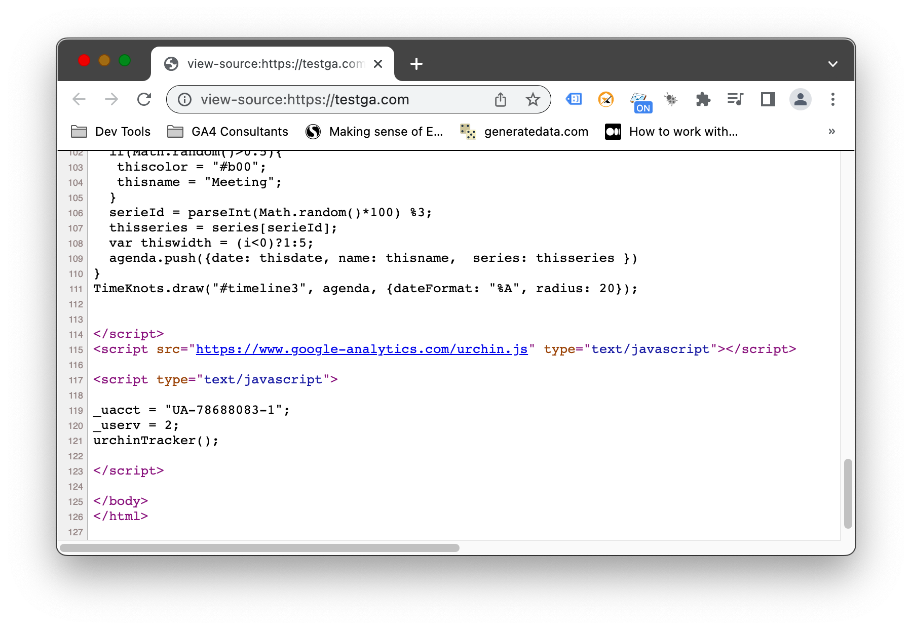
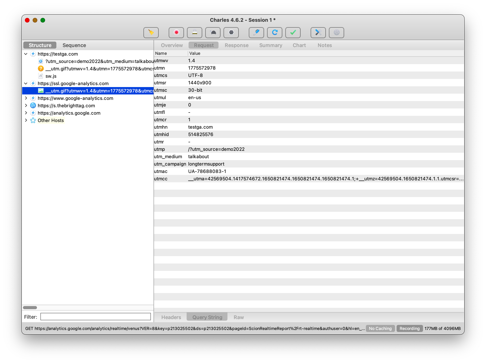
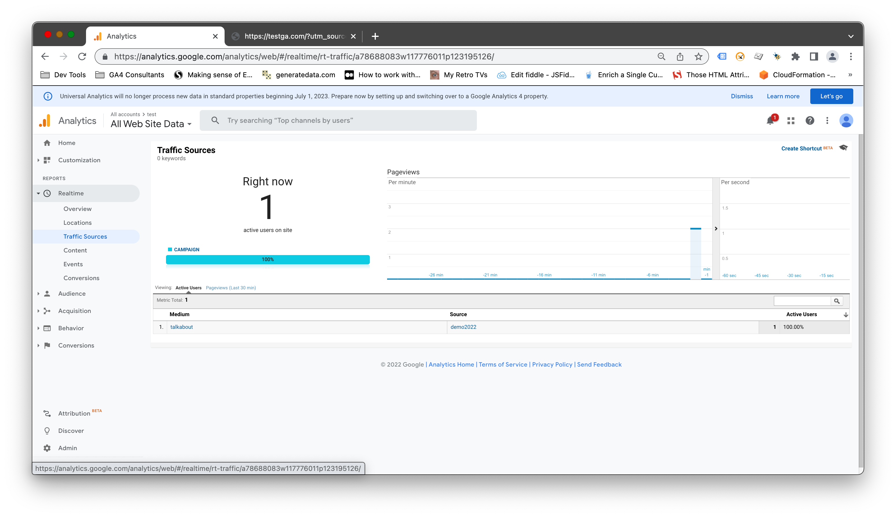

__Note: This post has nothing to do with Paw Patrol. Except that my toddler asked me to name it Paw Patrol, so there it is.__

How Big a Change is the Move to GA4?
====================================

Since so many people are talking about what a huge change the sunsetting of Universal Analytics is, I decided to see if I could still use the tracking code from back when the tracking code still used "Urchin" in its name (circa 2007 or so). It's located at https://www.google-analytics.com/urchin.js :

(the _userve = 2 is a flag to allow local logging of hits; so if this works it should send data both to google-analytics.com and my own web server logs at testga.com )

###Sure enough it does:###

###And it shows up in realtime reporting as well:###

That means if you had set up GA for a site back in 2007, left the tracking code intact, you'd still be collecting data today.
 
That will no longer be the case in August of 2023.

So, pretty big.
---------------

Google is basically giving itself a blank(er) state from which to build the future of tracking. While tracking when GA was first introduced was heavily focused around the web and web experiences, now tracking is focused around the user and the variety of ways they experience _all_ of your properties- web, app or offline.

They do this by focusing on the individual event. Each row of data GA4 collects is an event entry, with additional information on the user and their actions. That data is then basically pivoted in a variety of ways to create the reports you see, but at the core each entry is an event.

The basic makeup of the event is information about the user, along with detailed information about the action the user took. This [post](/GA4-events-explained-sortof) describes events in more detail, but in layman's terms the each event has very detailed information of a very time-specific limited scope; the value in GA4 comes in combining all of them into a story.

Fortunately, the degree of data collected is up to you, and GA4 provides a super-robust way to query the data in BigQuery.

